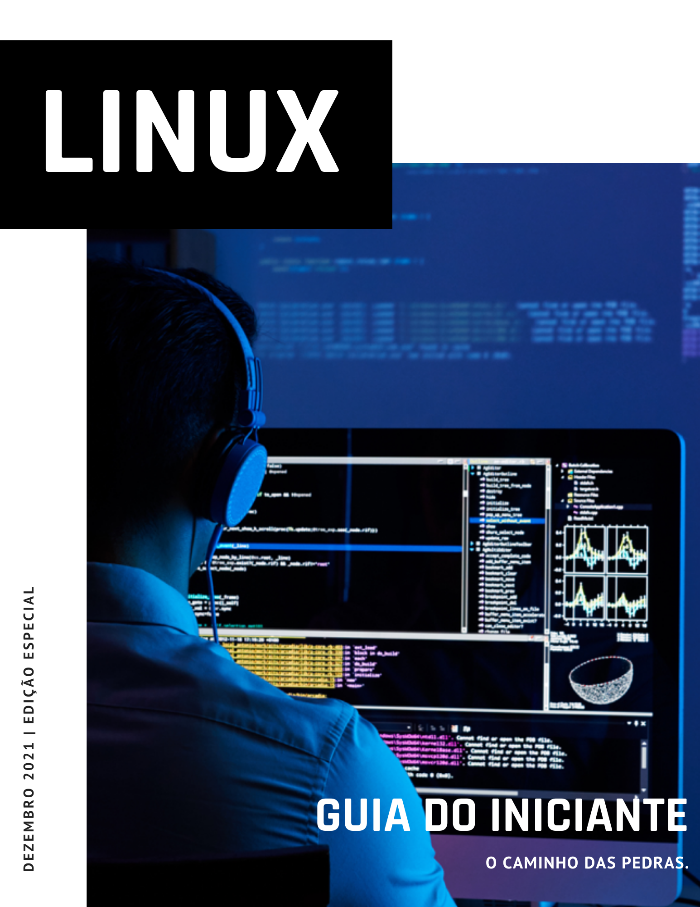

# Nesta edição

## Notas do autor

O Linux é incrível, fantástico.
- Certo
- Concordo

## O Linux me motiva a ensinar

É comum meus alunos perguntarem sobre minha tatuagem do Tux, mascote oficial do Kernel Linux. O Tux é este pinguim barrigudo, criado por Larry Ewing em 1996 e se tornou "a cara do Linux".

Alguns alegam que seu nome é a deriva de Torvalds Unix, um nome sugerido por James Hughes, mas o fato é que este pinguim que parece estar de smoking, simboliza um dos projetos mais brilhantes do mundo computacional.

Não seria possível iniciar este artigo, sem falar das minhas "celebridades", os, caras e mulheres que admiro, aqueles que eu tiro meu fedora vermelho. A iniciar, uma mulher, Augusta Ada Byron King, criadora do primeiro programa computacional da história!

Em uma carta para sua mãe, esta mulher incrível escreve:

> if you can’t give me poetry, can’t you give me “poetical science?” ” (Se você não pode me dar poesia, não pode me dar ciência poética?) .

Mas, deixarei para outro artigo, a história da Condessa de Lovelance que desenhou um pássaro mecânico aos doze anos. E nós se achamos incríveis quando programamos #echo "Hello World", não é mesmo?

Seguindo pelas pessoas que passaram ou estão neste mundo que admiro, segue: Ken Thompson e Dennis Ritchie, os pais do Unix e da linguagem C. Sim, as personalidades que admiro não são "pop stars" de garagem, não que estes não tenham criado uma grande revolução ao mundo computacional, mas alguns deixaram em muito a desejar como "seres humanos", tratando mal a todos que os cercavam, graças ao egocentrismo que os dominavam.

E infelizmente, ao estudar mais sobre a vida de alguns pais fundadores do movimento que tanto admiro (free software/ open source) fico decepcionado em saber que muitos se perdem em suas filosofias e crenças, beirando o crime, com discurso de ódio em que alguns defendem dizendo serem "essentricos".

Voltando aos meus ícones, não teria como não mencionar o Professor. Andrew S. Tanenbaum o qual conheci na época de faculdade, lendo o seu livro obrigatório para qualquer curso de TI (Modern Operating Systems). Eu não o conheci pessoalmente, mas ao ler sua biografia, fiquei admirado.

> O que dizer de alguém que escreve um sistema operacional para ensinar seus alunos o que é um sistema operacional?

Aliás, foi devido ao Minix, sistema de Tanenbaum, que surgiu o Linux. O jovem estudando da Finlândia, tornou o "Minix melhor que o minix" e booom!! Surgiu o Linux.

Linus Torvalds, outra das minhas "personalidades", tem lá seus defeitos, mostrou o dedo do meio para a Nvidia, falou durante (anos) boçalidade aos outros desenvolvedores do Kernel, mas pelo menos este, se desculpou: "Eu sinto muito", continuando com os dizeres que "teve um comportamento pouco profissional e descabido" ausentando-se do desenvolvimento do kernel linux para buscar ajuda profissional e se tornar um ser humano melhor.

Mas, sem mais delongas, por que o linux me motiva a ensinar?

Por que ele é fruto de estas mentes geniais; e todas elas têm algo em comum: criar algo útil a humanidade e compartilhar conhecimento.

Quando você usa Linux, quando você entende a engenharia fantástica por trás de tudo, quando você entende que não é uma empresa e sim pessoas do mundo todo, criando pedaços de código de programação que se encaixam, que doam tempo, suor e lágrimas, para eu poder desfrutar de um sistema seguro, rápido e confiável, sua mente explode! Você simplesmente quer compartilhar um pouco de tudo isto; é por isso que o Tux está sobre minha pele, Linux, me incentiva a ser um ser humano melhor diariamente, a compartilhar informação, a ensinar.

Linux, para mim, é mais que um software de computador, é uma história de evolução, de compartilhamento de conhecimento. Através deste software, conquistei tudo o que tenho e tenho muito ainda a conquistar, tanto em bens materiais como em conhecimento!

E para fechar,

***"A vida é muito boa, e sempre vai dar certo!".***

# Afinal, o que é o Linux?

## A grosso modo falando...

Ah sim o Linux. Este incrivel montade de código, escrito por pessoas incríveis do mundo todo, que formam um software poderoso, capaz de ser executado nos maiores e mais poderosos computadores do planeta a pequenos relógios de pulso. O Linux, a grosso modo falando é o núcleo de um sistema operacional, que chamamos de Distribuição de Linux. Entre tantos softwares que você possui no seu computador, o sistema operacional é o mais importante deles, por quê é a interface entre você e sua máquina. Sem o sistema operacional, seu computador não poderia ser operado (não por nós humanos comuns). O sistema operacional moderno, gerencia seus discos, memória, saída de vídeo e todo seu hardware de modo geral. Ele permite que você tenha uma camada para interagir com o computador atráves do modo-texto (CLI - ***Command Line Interface***) ou modo gráfico (GUI ***Graphical User Interface***).

Todo sistema operacional possui um núcleo, que é o código responsável por fazer seu hardware funcionar e oferecer a você a interatividade com o computador. Em uma distribuição de Linux, o núcleo (kernel) é o Linux. O Kernel Linux é tão poderoso e leve, que roda em praticamente tudo, tem gente que diz que linux roda até em uma batata. Como bom gordo que sou, nunca sobra uma para eu testar.

## Como tudo começou?

texto aqui

## Entenda as licenças

texto aqui

## Entenda os termos comuns

Texto aqui

## Qual distribuição escolher?

Texto aqui

## Linux no Desktop

Texto aqui

## Por que usaremos o Ubuntu?

Texto aqui

## Virtualização - Virtualbox

Texto aqui

## Instalação do Ambiente

Texto aqui

## O Ambiente GNOME

Texto aqui

## O que é um pacote de software?

Texto aqui

## Gerenciamento de pacotes DEB

Texto aqui

## Gerenciamento de pacotes Flatpak

Texto aqui

## Gerenciamento de pacotes SNAP

Texto aqui

## Softwares úteis

Texto aqui

## Instalação de pacote avulso (Chrome, Edge, Teams)

Texto aqui

## Instalação de codecs essenciais

Texto aqui

