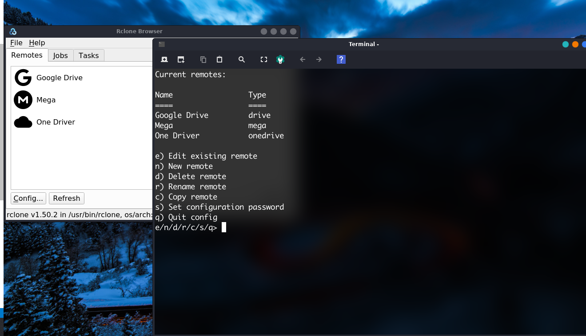
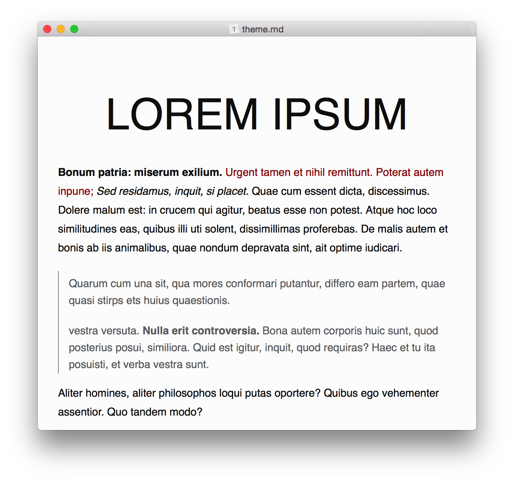

# Magazine Linux


[TOC]


## Sobre a revista

Esta revista digital é fruto das públicações que realizo no blog: [profjulianroamos.github.io](/home/juliano/Imagens/Foto de Perfil/perfil.jpg) diariamente. O objetivo desta documentação, é proporcionar uma leitura off-line, que pode ser realizada facilmente através de seu Tablet ou Smartphone. 

## Sobre o autor


Olá, sou o Prof. Juliano Ramos, criador e mantenedor do canal no youtube <https://www.youtube.com/profjulianoramos>.

Sou Certificado Linux Professional Institute desde 2002 - Nível II, Certificado SUSE  CLA, Red Hat RHCSA, Certificado CISCO CCNA e ITIL, autor de dezenas de  e-books sobre a Administraçãode Sistemas Linux. Usuário linux desde  2000.

Consultor desde 2004, quando obtive minha primeira certificação pela Conectiva Linux.

###  Mais sobre mim

\- [Meus cursos](https://profjulianoramos.github.io/cursos/)

\- [Meu currículo](https://profjulianoramos.github.io/curriculo/)

\- [Aula particular e consultoria](https://profjulianoramos.github.io/consultoria/)

\- [Meu livro sobre Servidores Linux](https://www.casadocodigo.com.br/products/livro-admin-linux?_pos=1&_sid=d71091948&_ss=r)

### Estou no Telegram

Agora tenho um grupo no telegram, para um bate papo mais direto sobre linux, aplicativos, servidores e certificações.

<https://t.me/profjulianotux>


## Quando é lançada uma nova edição?

Uma nova edição da revista é lançada sempre a cada 20 públicações no Blog. Isto equivale, quase a um mês. Você pode acompanhar tudo fresquinho lá no blog e depois, realizar o download do arquivo e ter a base de conhecimento com você. 

## Conheça o UbunTUX linux

Antes de qualquer coisa, quero dizer que este projeto não tem a ambição de ser mais uma distribuição linux, nem tão pouco, estamos apenas trocando o papel de parede e dizendo se tratar de uma remasterização. Existe muita coisa sobre o capô, e queremos que você venha, explorar junto com a gente.

### Um conceito de desktop novo

Uma coisa legal em se ter um canal de linux no youtube, é que eu sempre recebo feedback das pessoas sobre as diversas distribuições que apresento. E olha que são muitas! 

Percebi, que o conceito padrão de área de trabalho, poderia ser ajustado, para ser mais produtivo. Então, chega o Raul Dipeas, que mantinha o Radix Linux e mostra uma série de scripts fantásticos, que deixam o Xubuntu muito mais divertido. 

Gravei logo um vídeo com ele explicando tudo e subi lá no canal, sucesso! E com isso, recebemos dezenas de mensagens de pessoas que gostariam de ter uma imagem pronta das modificações. 

Conversei com o Raul, e resolvemos unir o conhecimento dele em criação de distros, com a minha bagagem youtuber e também de professor universitário e de certificações Linux, para criar uma nova amostra do Xubuntu 20.04. 


### Não é qualquer software 

A primeira questão, neste tipo de projeto é: O que vamos incluir e por qual motivo? Partimos então, pelo conhecimento do Raul Dipeas com o feedback dos usuários Radix, somado ao feedback dos telespectadores do meu canal, logo, tinhamos uma gama de softwares populares e alguns quase que inéditos, mas que eram estáveis, seguros e de fácil utilização.

Como exemplo a esta gama de software, vou colocar o Rclone e o Snowflake. Este primeiro (rclone) já permite que você acesse pelo gestor de arquivos, seus serviços como : 

- Google Drive
- One Drive
- Mega

Entre tantos outros. E o SnowFlake, é um cliente SSH gráfico, muito moderno e de fácil utilização.

E ambos foram publicados no canal com uma aprovação altissíma. 


### E o kernel?

O Kernel padrão do Xubuntu foi alterado para o XanMod, que traz otimizações e novos recursos. 


As principais características deste kernel:


   - Kernel preventivo completo sem ticks a 500Hz com agendador de núcleo de CPU ajustado.

   - RCU Boost para melhor desempenho multitarefa e menor latência de tempo de estrutura do DRI.

   - Camada de blocos com várias filas ajustada com agenda
      - Melhorias de cache, Gerenciador de memória virtual e CPUFreq Governor.
   - Controle de congestionamento TCP BBR + algoritmo de gerenciamento de filas CAKE.
  - Implementação do ORC Unwinder para rastreamentos de pilha do kernel (debuginfo).
  - Patchset de terceiros disponível: suporte ao kernel, initrd e módulos do ZSTD [5.7] [5.6] [5.6-rt] , Linux claro [parcial] , Wine / Proton Fsync, substituição do PCIe ACS, BMQ Process Scheduler [5.4] [estoque desabilitado] , Aufs [5.7] [5.6] [5.4] e GCC graysky's.
    Compilação do kernel Linux em tempo real (PREEMPT_RT) disponível [5.6-rt] [5.4-rt] .
- Pacote genérico de kernel para compatibilidade com a maioria das distribuições baseadas em Debian e Ubuntu. Construído sobre o mais recente GCC 10.1 e Binutils 2.34.
- Licença GPLv2. Pode ser construído para qualquer distribuição ou finalidade.


### Além de um sistema operacional, uma formação profissional

O objetivo do nosso projeto, vai além de fornecer um excelente sistema operacional. Vamos incluir nele, um centro de aprendizado gratuito, ou seja, você vai aprender linux de um modo profissional, inclusive com cursos preparatórios para a certificação linux.

Já vai incluso no sistema, meu curso gratuito preparatório para certificação LPIC-1 e um curso específico para o UbunTUX!


### Como posso ser um usuário de teste?

Se você se interessou pelo nosso projeto UbunTUX, preencha o formulário abaixo:

<https://forms.gle/unzKDqnomPwoLi4B9>

Vamos selecionar algumas pessoas que estejam dispostas a passar feedback sobre sua experiência de uso com o sistema. Se você quer aprender algo novo, que pode ser até mesmo usado como experiência profissional voluntária, este é um ótimo começo. Mas atenção, é necessário que você tenha uma conta no GitHub. Então, vai lá e se cadastra, é rápido e gratuito.

Atualmente estamos só eu e o Raul neste projeto, que está acabando de sair do forno. Venha fazer parte.

Blog do Raul
<https://rauldipeas.github.io/>

### Vídeo no youtube sobre o Ubuntux

<http://www.youtube.com/watch?v=1nwp9AXc1ic>

## Um upgrade no comando df

O comando **pydf** permite que você visualize o espaço em disco do seu servidor de uma forma mais amigável que o retorno do comando **df**.

Esta é uma ferramenta em *python* como o próprio nome já sugere. 


### Instalação

O comando **pydf** está disponível nos repositórios Ubuntu/Debian, então:

```bash
sudo apt install pydf
```

Agora é só executar:

```bash
pydf
```

### Personalizar as cores

Você pode editar o arquivo **/etc/pydfrc** para uma configuração global (todos os usuários). Ou para apenas o seu usuário:

```bash
cp /etc/pydfrc ~/.pydfrc
vi ~/.pydfrc
```

Esta é uma dica do tipo *bolachinha* que você aprende em um minuto. 

Commits:

- Publicação: 16/06/2020 - 15:48


## Comando onefetch

Se você deseja conhecer os detalhes de seu projeto de software rapidamente e de uma forma bem bonita pelo terminal, instale o **onefetch**. 


O onefecth é uma ferramenta (CLI) que pode verificar diretórios e projetos baseados em GIT e fornecer um resumo elegante. Isso inclui a divisão de autores, informação de criação e alteração do repositório, composição do idioma, informação de licenciamento, linhas de código e etc... São suportadas cerca de 50 linguagens de programação.

Veja minha saída do blog:


### Instalação 

O onefecth está disponível em pacote snap:

```bash
sudo snap install onefecth
```

## Extensão para Firefox modifica a usabilidade do Youtube


Estou sempre em busca de ferramentas que tornem meu trabalho mais efetivo. Isto inclui, encontrar melhorias para minha produtividade. 


A extensão *Enhancer for Youtube* permite personalizar o youtube, incluindo 15 temas do estilo Dark:


Opção para destacar o player em uma janela pop-out. O que é bem diferente da opção de destacar o vídeo oferecida pelo navegador (que fica na mesma página). Deste modo, você pode, abrir outras abas com o vídeo sendo exibido. 


O modo cinema também é interessante para quando você quer focar no que está assístindo. Já que todo site fica escuro e você só visualiza o player.

A ferramenta também permite bloquear anúncios nos vídeos, controlar a velocidade de exibição entre outras coisinhas que deixo para você explorar. 

Link da extensão para o firefox:

[clique aqui](https://addons.mozilla.org/en-US/firefox/addon/enhancer-for-youtube/?src=homepage-primary-hero)

## Curso gratuito - Certificação Linux LPIC-1


Estou oferecendo o único curso gratuito preparatório para a Certificação LPIC-1 prova 101-500, em português e com conteúdo atualizado. As aulas estão sendo publicadas de segunda e quarta-feira. Você pode se cadastrar e ter acesso agora mesmo pelo Google Classroom.


<https://classroom.google.com/>


Após realizar seu login no site, clique para acessar uma turma e adicione o código:

**dr5b3sh**

O curso gratuito de Certificação LPIC-1 101-500 tem como objetivo não somente prepará-lo para realizar o exame de certificação, mas também, oferece uma base técnica de conhecimento. Você aprenderá:

- Como funciona a arquitetura do Linux
- Instalar e manter uma estação de trabalho linux
- Configurar uma rede
- Trabalhar com a linha de comando do linux
- Manipular arquivos e permissões de acesso, bem como a segurança do sistema
- Executar tarefas de manutenção
- Adicionar e gerenciar usuários e grupos

## Acessa o informativo no meu canal do youtube

[](http://www.youtube.com/watch?v=hLN9gVkIJcg "cursolpi")

## Instalando o Microsoft Teams no Linux


O Microsoft Teams agora possui versão para linux do seu cliente desktop. Aprenda a instalar e conectar-se com sua equipe de trabalho.


A Microsoft dia a dia tem demonstrado mais respeito pelo linux e pelas ferramentas de código aberto. O Microsoft Teams é a primeira ferramenta do pacote MS Office a chegar no linux, e pode não ser a última.

O mais legal é que esta versão suporta todos os recursos que a versão para Windows. O ambiente é exatamente o mesmo para a equipe, não importa se ela usa Windows ou Linux.


### Instalando

Neste [link](https://www.microsoft.com/pt-br/microsoft-365/microsoft-teams/download-app#desktopAppDownloadregion) você tem acesso a página de download oficial. Com versão **.deb** e **.rpm**.


No caso do Ubuntu, basta fazer download e abrir com o instalador de softwares.


### Se conectando ao Teams

Após a instalação, inicie o aplicativo. Digite o seu endereço Microsoft no campo abaixo.


Provavelmente ele irá solicitar novamente o login e senha.

Selecione sua equipe.


Clique em continuar. 


### Conclusão

Embora muitos ainda hoje se recusem a usar soluções da microsoft como o Visual Studio Code (meu editor favorito) e o Teams, estas aplicações são uma realidade no mundo corporativo. A capacidade de se poder executar estes aplicativos no linux, pode ser o pontapé inicial para que as empresas cada vez mais adotem o pinguim como uma solução para as estações de trabalho.


## Browser Min

Se você procura um browser minimalista, que te faça focar mais no conteúdo, que seja rápido e muito leve. Apresento-lhe o **Min Browser**. 


Observe a imagem acima, o que você nota: Não tem barra para digitar a URL não é mesmo? Mas, é só você clicar ali em cima que ela aparece. 


Agora o mais legal, é que ele é integrado com o **DuckDUckGo** e isto permite uma busca (quase que dinâmica) do conteúdo, enquanto você está digitando. Realmente é muito rápido.

### Abas não, tarefas!

Lembra quando eu falei sobre focar no conteúdo. As abas ficam em um esquema de tarefa, que vocẽ abra através de um botão no cantinho do navegador. Veja:


É muito rápido e prático! 

### Privacidade

O Min Browser permite que você bloqueie scripts e imagens. 


### Open-source

O Min é escrito com Javascript, CSS e Electron. Seu código é aberto e distribuído no Github. 

<https://github.com/minbrowser/min>

### Instalar no seu Ubuntu/debian/mint

Quer instalar e conhecer. Abra o terminal:

```bash
wget https://github.com/minbrowser/min/releases/download/v1.14.1/min_1.14.1_amd64.deb 
```

Instale:

```bash
sudo dpkg -i min_1.14.1_amd64.deb 
```

No site tem pacote **.rpm** :  

<https://minbrowser.org/>


### Como estou usando

Faz uma semana que uso ele no dia a dia, para ler blogs, ver vídeos no youtube, acessar o site da universidade e criar meus cursos. Tudo funciona bem. Obviamente muitos serviços precisam de um browser como Firefox ou Chrome, serviços como o Google Meet para videoconferência. Nesta caso, eu vou para o firefox. O Min é uma solução interessante para que você se foque no que é realmente importante (conteúdo), executando os sites como um Webapp.


## GUI para SSH Snowflake

Snowflake é uma GUI para o SSH que aumenta sua produtividade e torna as coisas mais divertidas. 


Todos os dias eu utilizo o shell do linux e conecto servidor SSH para fazer monitoria. As vezes tenho dezenas de servidores para verificar e mesmo usando terminais em abas e painéis, a tarefa é trabalhosa, principalmente ficar se logando nos hosts, copiando arquivos via scp e monitorando os recursos das máquinas.

### Mas então, eu descobri o snowflake!

O Snowflake inclui um gerenciador de conexões, navegador de arquivos, emulador de terminal, gerenciador de recursos com análise do processador, análise de uso de disco, editor de texto, visualizador de log e ufa... autenticação de chave SSH. Provavelmente tem mais coisas, mas você terá que descobrir. 

### Instalando no Ubuntu/derivados

Abra seu terminal de comandos:

```bash
wget https://github.com/subhra74/snowflake/releases/download/v1.0.3/snowflake_1.0-3.deb /
dpkg -i snowflake_1.0-3.deb 
```


### Usando o snowflake

Vamos testar o software, fazendo uma conexão em nosso próprio host, ou seja : 127.0.0.1 

> Certifique-se que você tenha o servidor SSH instalado e funcionando.

Abra o Snowflake e clique em **new connection** preencha os campos como a primeira imagem aqui da publicação. 

Faça sua conexão. 


Você já será capaz de mover arquivo para o Host e vice-versa clicando e arrastando. Simples assim. :flushed:

### Abrindo arquivos 

A aplicação também possui um editor próprio muito bom. Clique com o botão direito no arquivo que deseja editar/visualizar, selecione "Open with - internal editor". 


Além disto, você tem facilmente opções de renomear, excluir, copiar e etc...

### O terminal

Clicando em terminal você já tem acesso ao Shell! O mais legal, você pode abrir mais terminais e trabalhar com múltiplos comandos ao mesmo tempo. 


### Monitorando recursos

Clicando em **System monitor** você tem acesso aos recursos do Host, simples assim! 


Aliás, é muito bonita a dashboard! 

Em **Disk space analyzer** você visualiza o disco do host:


Na seção **Active Transfers** você monitora as transferências de dados entre sua máquina e o servidor.

Na seção **Linux Tools** você obtêm:

- Informação do sistema
- Serviços (systemd)
- Processos e portas abertas


Você também pode gerar chaves criptográficas e usar algumas ferramentas de verificação de ping, porta, tracerout e dns lookup através de um simples clique. 

### Conclusão

O Snowflake é fantástico, se você usa interface gráfica e precisa trabalhar com servidores remotos. Ainda sobre seu terminal, você pode criar *snippets** que são como *alias*, no entanto, você os executa através de clique do mouse. 

Eu sempre procuro por ferramentas que me tornem mais efetivo e sem dúvida o Snowflake está em meu coração. 

## Ativar ZRAM no Linux


Se você utiliza linux a algum tempo, com certeza, conhece a área de troca, também chamada de SWAP. A partição swap é uma partição dedicada a ser usada quando um sistema utiliza um grande consumo de memória RAM. Quando isto ocorre, as páginas inativas são movidas da RAM para a partição swap.


O problema da swap é que ela reside em uma unidade muita mais lenta que a RAM, ou seja, seu disco rígido. Então, quando seu sistema começa a usar a S:worried:

O **zRAM** dedica uma parte da memória RAM para servir como espaço de troca. Então você deve estar se perguntando, se a SWAP entra em uso quando a memória RAM está em grande uso, reservar um espaço para isto não vai fazer com que ela entre em uso mais rápido?

Acontece, que os dados armazenados em uma partição zRAM são compactados, para que mais dados possam ser armazenados na RAM. E embora, uma pequena porcentagem do tempo da CPU seja usada para essa compactação, a troca de desempenho geralmente vale a pena. 

O zRAM está disponível em todas as distribuições linux, você precisa apenas ter permissão administrativa (root, ou sudo) para ativá-lo.

### Como ativar o zRAM

O módulo zRAM é controlado pelo systemd, portanto, não há necessidade de colocá-lo no **/etc/fstab**. 

Abra um terminal de comandos e crie o arquivo abaixo:

```bash
sudo nano /etc/modules-load.d/zram.conf
```

Neste arquivo coloque o valor:

```
zram
```

Salve e feche o arquivo.

Crie um segundo arquivo com o comando:

```bash
sudo nano /etc/modprobe.d/zram.conf
```

Neste arquivo, coloque os valores:

```
options zram num_devices=1
```

Salve e feche o arquivo.

Em seguida, precisamos configurar o tamanho da partição zRAM. Crie um novo arquivo com o comando:

```bash
sudo nano /etc/udev/rules.d/99-zram.rules
```

Nesse arquivo, coloque o valor abaixo, colocando a quantidade do tamanho para o zRAM que achar mais adequada a sua necessidade.

```bash
KERNEL=="zram0", ATTR{disksize}="1024M",TAG+="systemd"
```

Salve e feche o arquivo.


### Disabilite sua swap em disco

Acesse o arquivo **/etc/passwd** e desabilite a entrada da sua swap atual. 

Eu aproveitei e formatei a partição que eu tinha a swap.


### Crie um systemd unit

Agora, vamos criar um arquivo unit para o systemd. 

```bash
sudo nano /etc/systemd/system/zram.service
```

Coloque o seguinte conteúdo neste arquivo:

```bash
[Unit]
Description=Swap with zram
After=multi-user.target

[Service]
Type=oneshot 
RemainAfterExit=true
ExecStartPre=/sbin/mkswap /dev/zram0
ExecStart=/sbin/swapon /dev/zram0
ExecStop=/sbin/swapoff /dev/zram0

[Install]
WantedBy=multi-user.target
```

Habilite a unit com o comando:

```bash
sudo systemctl enable zram
```

Reinicie seu computador.

Verifique sua zram em uso:

``` 
cat /proc/swaps
```


### Uso só em 90%

Para que a swap só entre em uso quando o sistema atingir 90% da RAM disponível. Eu edito o arquivo **/etc/sysctl.conf** colocando os valor:

```bash
vm.swappiness=10
```


### Meu vídeo sobre desempenho no Ubuntu

Aproveite e assista lá no meu canal, meu vídeo sobre como melhorar o desempenho do ubuntu:

[](http://www.youtube.com/watch?v=wA1BIJYZbXI "desempenho")


## Armazenamento na nuvem com Rclone

Podemos sincronizar diversos serviços de armazenamento da nuvem diretamente no nosso desktop linux, através de duas aplicações: **rcloneBrowser** e **rcloneTray**. 


Para instalar as duas aplicações, abra seu terminal:

```bash
sudo apt-get install rclone-browser
wget https://github.com/dimitrov-adrian/RcloneTray/releases/download/v1.0.0/rclonetray_1.0.0_amd64.deb
sudo dpkg -i rclonetray_1.0.0_amd64.deb
```

### Configurar o Google Drive e One Driver

Abra o rclone browser pelo seu menu de aplicativos, clique no botão **config**.



Tecle [n] para um novo serviço remoto.

Coloque o nome do serviço, exemplo: "Google Drive".


Na lista que aparece, selecione o número do Google Drive (13).

Em **client ID** e **client secret** você só dá enter

Escolha a 1 opção (full acess...)

Em **root_folder_id** eu uso o padrão, só enter.

Em **service_account_file** também uso o padrão, só enter.

Em **advanced config** tecle [n]

Em **auto config** confirme com [y]

Vai abrir seu Browser. Confirme o acesso no google.

Ao retornar, coloque [n] em **team drive** e confirme tudo com [y]

Clique no botão **refresh** no Rclone Browser e verá seu Google Drive. 

Faça o mesmo procedimento para o one drive e outros serviços.

### Acessando os serviços

Abra o **Rclone Tray**. Na barra de tarefas clique sobre seu ícone, escolha o serviço e clique em **mount**. Clique novamente sobre ele, escolha o serviço e selecione **Open in file Browser**.

### Serviço do MEGA

O Serviço do MEGA pode ser feito direto pela tray. Clique no ícone do Rclone Tray e selecione **New bookmark** escolha **Mega**, coloque um nome seu usuário e senha. 


### Meu vídeo sobre isto no canal

[](http://www.youtube.com/watch?v=sSmLu1xzJ-Y "nuvem")

## Lançamento do Vivaldi Browser

Acaba de ser lançado o navegador Vivaldi 3.1, compatível com Microsoft Windows, Mac e Linux. Entre os novos recursos, um destaque para a inicialização mais rápida, além de um gerenciador de anotações de página inteira e menus configuráveis.


O Vivaldi tem como base o Chromium 83 que é um dos navegadores mais estáveis, sendo base para outros navegadores como por exemplo o Edge da Microsoft. Recentemente eu fiz um vídeo falando sobre minha experiência positiva com o Vivaldi, que você pode assistir clicando na imagem abaixo:

[](http://www.youtube.com/watch?v=tFGyEl4tfSc "vivaldi")


### Notes manager, quase um editor de texto


O vivaldi possui uma função para editar notas, enquanto você navega na WEB. Este novo notes manager, tem um editor que permite criar uma bela documentação. 


### Menus configuravéis


Agora é possível editar itens que vão aparecer ou não no menu. 

Você pode saber mais, lendo a nota de lançamento:

<https://vivaldi.com/pt-br/blog/vivaldi-gets-notes-manager-and-configurable-menus/>

### Instalando no Ubuntu e derivados

Abra seu terminal de comandos e execute:

```bash
wget https://downloads.vivaldi.com/stable/vivaldi-stable_3.1.1929.29-1_amd64.deb \
&& sudo dpkg -i vivaldi-stable_3.1.1929.29-1_amd64.deb
```


## Moodle Desktop

O moodle desktop é um app oficial do moodle para Microsoft Windows, Linux, Mac Os e Android. O software permite que você acesse seu site moodle (como o dos meus cursos) e de universidades, promovendo uma interface única e diferenciada.


### Instalando no Linux

No linux o software é distribuído como um *Appimage*, o que torna sua instalação muito simples. Você precisa apenas fazer o download, descompactar, colocar permissão de execução e executar.

Links de download

[versão 64 bits](https://download.moodle.org/desktop/download.php?platform=linux&arch=64)

[Versão 32 bits](https://download.moodle.org/desktop/download.php?platform=linux&arch=32)

Após o download, clique com o botão direito do mouse sobre o arquivo e escolha (extrair aqui):


Clique no executável com o botão direito, entre em propriedades e marque (permitir que este arquivo execute como programa).


Agora, clique duas vezes no arquivo.


Quando o aplicativo abrir, coloque no campo URL o endereço do nosso portal de cursos:


<https://true.certificacoes.net.br/linuxltc1>

Clique em conectar. Se você ainda não possui uma conta em nosso site, escolha a opção **criar uma conta**. Utilize um e-mail válido, já que ele será validado.

Quando obtiver uma conta, faça seu login.


### Meus cursos gratuitos

Ao fazer login, clique na caixa de busca:


Os seguintes cursos estão gratuitos:

- Linux básico para iniciantes com Deepin
- Administrador de sistemas Debian
- Servidor Raid e LVM - Storage
- Curso básico de Shell Script

Pesquise um destes cursos e clique em inscrever-se. 

Na tela inicial em **painel** você terá acesso a todos os seus cursos.


### Navegando no curso

Clique sobre seu curso e abra a seção, sempre pelo tópico 1.


Dentro do tópico, visualize o conteúdo. As aulas sempre possuem o ícone: 


Quando finalizar o tópico 1, siga para o 2 e etc...

### Emitir o certificado

Coloque a opção (Todas a seções). E selecione "Emitir certificado". Alguns cursos exigem que você faça um questionário de conclusão.


### Video sobre esta publicação

Em nosso canal temos um vídeo sobre esta publicação. Ao clicar na imagem abaixo, você será redirecionado para o meu canal no youtube.

[](http://www.youtube.com/watch?v=Xb3gNcMzFFw "moodle")

### Conclusão

O moodle desktop é uma ferramenta interessante que permite explorar o seu site moodle com um layout diferente. 


Veja na imagem o nosso site e ele sendo apresentado no Moodle Desktop. 

## Crie sua distribuição Linux

Neste primeiro tutorial sobre este assunto, vamos usar o software LB Build criado pela própria comunidade Debian, para customizar a distro. 


### Pré-requisitos

1.  Debian
2.  Versão atualizada do Live-build
3.  Bash
4.  Internet

### Licença de uso

O linux utiliza a licença GPL, o que permite a qualquer um criar um remaster ou distribuição própria. É necessário preocupar-se com as licenças de software que você irá usar em seu sistema.

### Drivers proprietários

Nunca instale drivers proprietários em seu remaster. Por padrão pode ocorrer diversos erros, sendo assim, o ideal é que o usuário final instale estes drivers caso necessário. 

### Qual Debian utilizar?

É recomendado utilizar a versão **Stable** do Debian. 

### Distribuição ou Remasterização.

Normalmente uma remasterização tem uma finalidade específica para um público específico. Exemplo: Uma distro para sua empresa com as ferramentas de uso padrão. 

Já uma distribuição, tem um público maior (usuário final), neste caso você precisa pesquisar por programas que serão adicionados, personalização de interface, configuração de repositório e etc...

### Live Build

Live-Build é criado pela própria comunidade Debian. Sendo um conjunto de scripts para criar imagens do sistema live.

### O que tem em uma imagem live?

- Imagem do kernel linux - Geralmente chamada de vmlinuz
- Imagem do disco RAM inicial - initrd (O live build cria esta etapa)
- Imagem do sistema (Squashfs) é uma compactação da imagem - Sendo somente leitura.
- Bootlooader - Software para iniciar e selecionar um kernel e outras opções.

### Download e instalação do Debian

Debian - versão mínima (netinstall)

Link direto para download:

<https://cdimage.debian.org/debian-cd/current/amd64/iso-cd/debian-10.3.0-amd64-netinst.iso>

Instalar em uma máquina virtual - Recomendo: Virtualbox. 

Coloca entre 30 e 50GB de HD virtual -  Em rede, coloca em modo bridge - na instalação do Debian, em seleção de software, deixe marcado apenas:

- Utilitário de sistema padrão
- Servidor SSH

Verifique o IP da máquina virtual instalada e para facilitar as ações (como ter opção de copiar e colocar) acesse esta máquina via SSH, exemplo:

```# ssh live@192.168.10.100```

### Repositório adicional

Adicionar em `/etc/apt/sources.list`o repositório:

deb http://ftp.br.debian.org/debian/ buster main contrib non-free

Atualize a lista de repositórios:

```# apt-get update```

### Instalação do live-build

```# apt-get install live-build live-manual live-config schroot```

### Criando o diretório de trabalho

```# mkdir /home/live/live```

Acesse o diretório criado e execute o comando:

```# lb config```

Observe que será criado três diretórios:

- auto
- config
- local

Agora execute o comando `lb build`mas detalhe: 

**Este comando não funciona via SSH por causa do diretório path do chroot.** 

```# lb build```

Este comando vai gerar uma imagem hibrida do sistema. A primeira vez que executamos este comando o processo demora, por que é feito download da imagem no site do debian. 

Quando concluir, você terá algo como : live-image-amd64.hybrid.iso nos seu diretório. 

Você pode copiar esta imagem para seu sistema host e testá-la com o virtualbox. Para puxá-la com o scp, use o comando:

```# scp live-image-amd64.hybrid.iso juliano@192.168.10.40:/tmp```

Você pode testar no virtualbox esta imagem, que vai estar funcionando apenas o modo live. As opções (install e graphical install) ainda não foram habilitadas.

### O diretório cache

A partir de agora não será mais necessário fazer o download de todos os pacotes no site do debian, já que estão informações estão no diretório **cache**. 

Para limpar o projeto anterior e iniciarmos de fato a criação de nossa remasterização, utilize o comando:

```# lb clean```

Este comando vai limpar os arquivos e a imagem hibrida, gerada anteriormente.

### Permitir a instalação do Debian

``` # lb config --debian-installer live```

A configuração fica no arquivo **/config/binary**.

### Permitir a instação em modo gráfico

```# lb config --debian-installer-gui true``` 

No comando abaixo devemos colocar o nome do instalador, referente a distribuição debian que estamos usando. No meu caso:

```lb config --debian-installer-distribution buster```

### Permitir ou não o memtest

O memtest é uma opção para ativar o teste de memória no grub. Uma opção, não muito utiizada que vamos desabilitar:

```lb config --memtest none```

### Finalizar imagem

```# lb clean``` 

``` # lb build```

Observe que o tempo será bem mais rápido do que a primeira vez, já que os arquivos estão em cache, ele somente vai baixar os arquivos do instalador do debian. 

### Definindo os repositórios padrão

Para definir os repositórios que serão padrão na live e após sua instalação, como por exemplo, os repositórios non-free (que contém software proprietário), utilize:

```# lb config --archive-areas "main contrib non-free"```

Para persistir após a instalação:

```# lb config --parent-archive-areas "main contrib non-free"```

Habilitar por padrão o repositório de segurança (security):

```# lb config --security true```

### Comandos essenciais

Definir o tipo de sistema da imagem:

```# lb config --parent-distribution buster``

Habilitar para que os indices sejam atualizados automaticamente (apt-get update):

```lb config --apt-indices true```

Definir o gestor de pacotes padrão:

```lb config --apt apt```

Definir a arquitetura do sistema:

```lb config --architectures amd64```

Definir a imagem que usuaremos na live:

```lb config --binary-images iso-hybrid```

Definir o nome da imagem:

```lb config --image-name remaster```

Definir o autor da imagem:

```lb config --iso-publisher "Juliano <profjulianoramos@gmail.com>"```

Definir um shell interativo durante o processo de compilação, para alguma alteração na imagem live:

```lb config --interactive shell```

### Adicionando interface gráfica

Crie um arquivo de lista para os aplicativos que irá instalar:

```# nano config/package-lists/grafica.list.chroot```

Adicione os nomes dos pacotes. Vamos usar o xfce4:

```
xfce4
xfce4-indicator-plugin
xfce4-power-manager
xfce4-battery-plugin
xfce4-datetime-plugin
xfce4-mount-plugin
xfce4-netload-plugin
xfce4-wavelan-plugin
xfce4-screenshooter
xfce4-sensors-plugin
xfce4-smartbookmark-plugin
xfce4-timer-plugin
xfce4-whiskermenu-plugin
xfce4-goodies
```

Crie outra lista com softwares diversos:

```# nano config/package-lists/diversos.list.chroot```

```
gdebi
file-roller
lsb-release
build-essential
module-assistant
linux-headers-amd64
gedit
vlc
mugshot
ristretto
nemo
unrar-free
rar
file-roller
p7zip
unzip
gnome-system-tools
ssh
net-tools
gnome-calculator
gcc
quota
engrampa
libuser
bash-completion
telnet
evince
pulseaudio-equalizer
cups
hplip
accountsservice
mugshot
apt-transport-https
network-manager
network-manager-gnome
net-tools
```

Execute o comando:

```
lb clean
```

Para limpara as outras configurações e crie a iso :

```
lb build
```


### Ainda existe muito a se fazer

Em um próximo tutorial, vamos abordar, como instalar os pacotes, sem a necessidade de uma lista de repositório, assim como, criar uma personalização global para nossa interface. 

## Aprenda Markdown

Mardown** é uma sintaxe usada para padronizar e facilitar formatação de texto na WEB, utilizada em aplicativos como o **slack** e aqui no **github**. 


> O markdown funciona como um conversos de texto para o HTML.

### Por onde começar

Você pode criar um arquivo de markdown, em praticamente qualquer editor de texto simples, salvando com a extensão **.md**. Eu particularmente, trabalho no Vscode e as vezes no Typora. 

### Instalando o Typora

O typora permite editar seus texto em Markdown de uma forma mais visual. Ele é ótimo para quem esta iniciando. 



Para instalar o Typora em seu Ubuntu, faça:

```bash
wget -qO - https://typora.io/linux/public-key.asc | sudo apt-key add -

sudo add-apt-repository 'deb https://typora.io/linux ./'

sudo apt-get update

sudo apt-get install typora
```

Se você usa outra distribuição, procure outros pacotes no link:

<https://typora.io/#linux>

### Usando o typora

O typora é bem simplista, ao iniciá-lo você já poderá começar a escrever suas documentações. Eu recomendo antes de tudo que você adicione o índice na lateral do aplicativo, como mostra a imagem abaixo:


O índice vai permitir que você navegue pela sua documentação através dos títulos e subtítulos. 

### Os atalhos do typora

Antes de começarmos a falar do **markdown** vamos conhecer alguns atalhos do typora. 

Com as teclas [ctrl+1] você aciona a opção de Título de Documento. 

[ctrl+2] você adiciona o subtítulo

[ctrl+3] você adiciona o terceiro nível de subtítulo

Como podemos ver na imagem abaixo:


Para colocar uma palavra em negrito, você pode usar:

[crtl+b] **negrito**

Para colocar uma palavra em itálico, você pode usar:

[ctrl+i] *itálico*

Clicando com o botão direito, você abre um menu, com basicamente tudo que você precisa para formatar um documento.


### Mas e o código markdown?

Você deve ter observado no typora que ao usar um dos atalhos de comandos, um código aparece. Por exemplo: Quando você aperta [ctrl+b] aparece ** a frente da palavra. 

Estes dois asteriscos, são o código markdown para texto em negrito. 

Ao invés de usar o atalho, digite no typora:

```markdown
**negrito**
```

Incrível não é mesmo? 

### Um pouco mais de código, por favor.

Vamos começar usando os códigos para o título:

```markdown
# Título 1 
## Título 2 
### Título 3 
#### Título 4 
##### Título 5
###### Título 6
```

Resultado :

# Título 1

## Título 2

### Título 3

#### Título 4

##### Título 5

###### Título 6


### Ênfase no documento

Para adicionar ênfase ao conteúdo que será escrito, usamos o asterisco * ou (*underline*)_:

Veja como é simples:

```markdown
**negrito**
*itálico*
```

### Links

Existem duas formas de inserir um link em Markdown. Através de um link direto ou um texto-âncora:

### Texto âncora

Utilizamos os caracteres ```[]()```, dentro da chave o texto e dentro do parêntese o link, exemplo:

```markdown
[blog do prof. Juliano](https://profjulianoramos.github.io)
```

### Link direto

Coloque o endereço URL dentro de chaves, exemplo:

```markdown
<https://profjulianoramos.github.io>
```

### Lista de ítens

Para listas não ordenadas, utilize um asterisco * na frente do ítem:

```markdown
* Item 1
* Item 2
* Item 3
```

Para listas ordenas, utilize:

```markdown
1. Item 1
2. Item 2
3. Item 3
```

As listas acima serão exibidas, desta forma:

* não ordenada 1
* não ordenada 2

1. ordenada 1
2. ordenada 2

### Imagens

O código para inserir uma imagem no conteúdo é semelhante ao código de inserir links-âncora. Adicionando apenas um ponto de exclamação a frente, exemplo:

```markdown

```

### Citação (Quote)

Para transformar um bloco de texto em uma citação, ou comentário, coloque o caractere > a frente, exemplo:

```markdown
> A vida é boa e sempre vai dar certo
```

### Colocando código no texto

Há dois modos de adicionar trechos de código em markdown. O primeiro é colocar o código em uma linha, e o outro, é colocar em múltiplas linhas.

Para colocar um código em uma linha utilize o acento grave ` no ínicio e final do código:

```markdown
`código aqui`
```

Para múltiplas linhas, coloque três acentos graves:

```markdown
código aqui
código na segunda linha
código na terceira linha
```

Você pode específicar que tipo de linguagem é o código, assim ele coloca uma sintaxe de acordo, exemplo:

```markdown
​```php
este é um código php``` 
```

Aqui está uma lista de [linguagens suportadas](http://pygments.org/languages/).

### Tabela

Escolha o título da coluna e use | para delimitar a coluno.
Depois utilize hífen - na segunda linha para indicar que acima está o título. As demais linhas, são separadas com | . 

Exemplo:

```markdown
Título | valor
--- | ---
Exemplo 1 | R$ 500
Exemplo 2 | R$ 1.000
Exemplo 3 | R$ 2.0000
```

Veja o resultado:

| Título    | valor     |
| --------- | --------- |
| Exemplo 1 | R$ 500    |
| Exemplo 2 | R$ 1.000  |
| Exemplo 3 | R$ 2.0000 |

### Conclusão

Eu utilizo praticamente todos os dias **markdown** e ele me torna mais produtivo, além disto, os textos ficam incríveis, mantendo um padrão profissional de formatação. Este blog por exemplo é inteiramente escrito em markdown. 

## Remover snap no Ubuntu

Antes de mais nada, você sabe o que é um snap?

>Snappy é um software de implantação e um sistema de gerenciamento de pacotes construído pela canonical. Os pacotes oferecidos por esta aplicação chamam-se "snap". O objetivo desta tecnologia é oferecer os paco
>tes em "contêiner", já com suas dependências, rodando assim em praticamente qualquer distribuição de linux. Este modo de operação também torna o software mais seguro e em caso de uma atualização ruim, você terá a versão antes da atualização pronta a ser utilizada.


### Por que remover o snap?

Antes de responder esta pergunta, quero informar que isto não deve ser para todos. Além das vantagens que coloquei sobre o snap, ele é responsável pela aplicação "Livepatch" do Ubuntu, que permite atualizações constantes nos pacotes e no Gnome oferecidas pela Canonical, além de oferecer diversos aplicativos (alguns exclusivos) a este tipo de pacote. 

Aliás, este é o ponto que alguns usuários e eu inclusive, optei por não usar SNAP no meu sistema. O primeiro ponto é que ao ativar o Livepatch, você tem uma porta aberta diretamente com a Canonical e eu particularmente, gosto de monitorar minhas atualizações e executá-las quando desejo. 

Outro ponto, é que os pacotes snaps estão amarrados a "snap store", se você olhar em seu gerenciador de processos. Vai perceber que só este processo, ainda que você não tenha nenhum pacote snap está consumindo uma média de 400 - 480MB de sua memória RAM. Para muitos isto pode parecer pouco, mas me incomoda bastante. 

Meu sistema sem SNAP após o boot, diminuiu de 1.9GB de RAM para 1.2GB de RAM. 

### Como posso remover totalmente o snap

Execute os comandos abaixo e reinicie o seu sistema. 

```bash
# sudo apt remove --purge snapd gnome-software-plugin-snap
# sudo apt autoremove
# sudo rm -rf /var/cache/snapd
# sudo rm -rf ~/snap
```

### E agora, onde encontro os meus softwares? 

Você ainda tem todo o repositório (pacotes .deb) a sua disposição. E poderá visitar os sites oficiais das aplicações, como por exemplo: spotify, skype, telegram e fazer download dos pacotes oferecidos por eles.

### Conclusão

Snap é uma nova tecnologia que veio para ficar, no entanto, o seu consumo alto de recurso e uma política não muito interessante para com os desenvolvedores de software por parte da canonical, faz com que muitos usuários desistam de usar esta tecnologia. O meu objetivo aqui não é criticar o SNAP ou quem utiliza, mas sim, trazer soluções e alternativas para o dia a dia no mundo linux.

## TMUX

Com o TMUX você pode criar várias sessões de terminal que podem ser abertas (anexadas) e fechadas (desanexadas) ou exibidas simultaneamente, tudo em uma única janela, aumentando assim sua produtividade.


### Instalar o tmux

O tmux esta disponível em praticamente todos os repositórios de distribuições Linux. Então, você pode facilmente realizar sua instalação pela sua loja de aplicativos.

No caso do Ubuntu/derivados, podemos instalar pelo terminal:

```bash
sudo apt install tmux
```


### Os primeiros passos

O tmux melhora sua produtividade. Mas no começo ele pode parecer complicado. Vamos conhecer as funcionalidades básicas deste software, para que você possa evoluir de forma gradativa na sua utilização.

### Criando uma sessão tmux

Abra um terminal e use o comando:

```bash
profjulianoramos@certificacoesnetbr:-$ tmux
```

Observe que na parte inferior do seu terminal, terá algo como uma barra de tarefas verde. 


O asterisco mostra a janela que esta ativa.

Vamos criar algumas janelas para você alternar. Você deve chamar a central de comandos tmux com : **[ctrl+b]** e depois tecle **c**. 

Observe na barra de tarefas que algo chamado **1:bash** foi adicionado.


Adicione mais uma janela. 

> O tmux em alguns casos renomeia a janela para o nome da aplicação que você está executando. 

### Alternando as janelas

Veja como alternar as janelas:

| Anterior   | Próximo      | n(0,1,2,3 etc.) |
| ---------- | ------------ | --------------- |
| [ctrl+b]+p | [ctrl+b] + n | [ctrl+b]+0      |


### Alternar usando a lista de janelas

Outra opção interessante é através do comando:

**[ctrl+b]** + w 

Você terá uma visão geral das suas sessões. Podendo alternar com as setas do teclado.

## Nomear ou renomear janelas

Você pode nomear sua janela atual usando a combinação:

**[ctrl+b}** + , 


### Criando painéis no tmux

A criação de painéis no tmux é uma das funções que eu mais utilizo. 

Você pode criar painéis horizontais e verticais. 

| Horizontal | Vertical    |
| ---------- | ----------- |
| [ctrl+b]+% | [ctrl+b]+ " |


Você alterna entre os painéis utilizando: **[crtrl+b]** + setas do teclado.

### Aplicar zoom em um painel

Você pode ampliar o painel selecionado usando:

**[ctrl+b]** + z

A tela vai usar o tamanho máximo. Usando novamente **[ctrl+b]** + z , você volta ao esquema de painéis.

### Fechando um painel

Você pode fechar um painel, usando :

**[ctrl+b]** + x

Você será questionado se realmente deseja fechar. Outro modo, é digitando **exit** no prompt.

### Mais do que o básico

Agora que você já está se divertindo com o tmux, que tal, aprender um pouco mais. O site <https://linuxhandbook.com> disponibilizou um arquivo em pdf com diversos comandos do tmux. [clique aqui para download](https://linuxhandbook.com/wp-content/uploads/tmux_cheat_sheet.pdf).

### Conclusão

Estou sempre procurando ferramentas para melhorar minha produtividade. O tmux é fantástico, no começo pode parecer confuso, mas com o tempo, você passa a amá-lo. 


### Mais sobre o tmux no nosso canal no youtube

O Professor Cicero, fez um vídeo incrível explicando o tmux. 

[](http://www.youtube.com/watch?v=9kgBUO6Beak "tmux")

## Introdução a certificação LPI

Bom dia, boa tarde e boa noite! Se você ainda não me conhece, sou o professor Juliano Ramos. Tenho dedicado um grande tempo da minha vida aos estudos de Linux e servidores. Sou professor por amor. Para mim não é trabalho, ou qualquer outra definição. Acredito que é por isto, que sempre procuro fazer o diferencial em minhas aulas.

Esta nova série de publicações aqui no Blog, tem como objetivo, abordar o conteúdo da prova 101-500 da certificação LPI. 


### Estude comigo

Este livro é a base dos meus cursos. Você pode fazer um curso comigo com aulas gravadas pelo site:

<https://www.certificacoes.net.br> 

Ou se preferir, pode fazer um curso comigo, on-line ao-vivo com aula particular. Para isto é só me chamar, todos meus contatos estão aqui a esquerda da publicação.


### LPIC - Linux Professional Institute Certificate

A LPI tem um conjunto de certificações que são independentes de distribuição de linux. Ou seja, você pode estudar para a prova usando qualquer distro linux.


*A Linux Essentials não é pré-requisito para nenhuma certificação.* 

### LPIC1

1. Voltada para Administadores de sistemas Linux
2. O profissional deve ser capaz de realizar tarefas de manutenção, instalação e configuração em qualquer sistema linux, via linha de comando.
3. **2 provas:** LPI 101-500 e 102-500. Cada uma com 60 questões e 1:30h de prova.


Para você receber a certificação LPIC1 é necessário ser aprovado nas 2 provas.


### Virtualbox

Execute os comandos de estudo através de uma máquina virtual, recomendo o virtual box.

Referência:

<https://www.virtualbox.org>

O Virtualbox é multi-plataforma (Windows, Linux , Mac, Solaris)

### Distribuições Linux

As certificações da LPI e da CompTIA não são focadas em nenhuma distribuição específica, dessa forma você pode estudar e praticar em qualquer distribuição Linux.

Mas em um momento específico, vamos estudar gestão de pacotes .deb e .rpm, então, teremos que usar uma distribuição baseada em Debian e outra em Red Hat..

### Distribuição leve

Como a certificação de linux é independente de distribuição e vamos focar somente na linha de comando, usaremos para nossos estudos o Debian, versão (netinstall) apenas linha de comando. Você já pode ir se preparando para a próxima aula, fazendo o download dele.

Link:

<https://cdimage.debian.org/debian-cd/current/amd64/iso-cd/debian-10.4.0-amd64-netinst.iso>


### Segunda e quarta, videoaula gratuíta. 

Em nosso canal, vamos estar disponibilizando aulas, toda segunda e quarta-feira. O complemento em texto da aula, você visualiza aqui no blog.

Veja nossa primeira aula:

[](http://www.youtube.com/watch?v=DjjKle8Tiww "lpi")


## Instalando Kernel no Linux Lite

O Linux lite é uma distribuição muito prática e intuitiva. Atualizar o kernel nesta distribuição chega a ser uma tarefa trivial. 

O sistema possui uma ferramenta que automatiza a instalação de uma nova versão do Kernel Linux. Você realiza esta tarefa com apenas alguns cliques do mouse. 


### O processo de instalação

Abra o utilitário **Lite Tweaks** no seu menu de inicio e escolha a opção **Kernel Installer**. Observe na imagem abaixo como é simples o processo:


Site oficial da distro:
<https://www.linuxliteos.com/>

### Conclusão

O Linux lite é uma distribuição fácil de usar e conta com algumas facilidades para quem deseja manter o sistema sempre atualizado e não quer enfrentar o terminal. 


## 8 Dicas de segurança para o SSH

O SSH é o método mais utilizado pelos Sysadmins, para acesseram seus hosts remotamente. O que pouca gente sabe, é que ele pode ser a causa de seu servidor ser comprometido. 

O protocolo SSH é muito seguro, mas isto não significa que você deva usar a configuração padrão do serviço cegamente.


**Aviso importante** 

> Não siga as dicas cegamente. Leia e entenda se ela se adequa a sua necessidade. 


## O arquivo de configuração

O arquivo de configuração do SSH fica em **/etc/ssh/sshd_config**. A maioria das dicas mencionadas neste tutorial, tem como base a edição deste arquivo. Então, antes de mais nada, faça seu backup. 

### 1 - Senhas vazias

No linux é possivel você criar usuários sem senha. Se este usuário tentar acessar o SSH, ele também não precisará digitar uma senha. 

Isso é um risco a segurança. Para proibir o acesso a senhas vazias, edite no arquivo **/etc/ssh/sshd_config** a opção:

```bash
PermitEmptyPasswords no 
```

### 2 - Alterando a porta padrão

A porta SSH padrão é 22. A maioria dos scripts de ataque são escritos com esta porta. Alterar esta porta é uma camada a mais de segurança para seu servidor. 

Dentro do arquivo de configuração, altere a porta, para um número diferente, exemplo:

```bash
Port 2345
```

### 3 - Desative o login de root via SSH

O root em servidores deveria ser proibido. Uma política bem escrita com o sudo já proporciona uma segurança melhor. Para desativar o acesso do root no SSH, no arquivo de configuração, defina:

```bash
PermitRootLogin no
```

### 4 - Desative o protocolo ssh 1

Isto é somente para distribuições mais antigas. As atuais oferecem apenas suporte ao protocolo 2. Se você tem dúvidas, adicione no arquivo:

```bash
Protocol 2
```

### 5 - Tempo de inatividade

O tempo de inatividade é quanto tempo uma conexão SSH pode ficar ativa sem nenhuma atividade. O intervalo de tempo limite é contado em segundos e, por padrão, é o 0. Você pode alterá-lo para 300 para manter um intervalo de tempo limite de cnco minutos.

```bash
ClientAliveInterval 300
```

Após este intervalo o servidor SSH enviará uma mensagem ativa ao cliente. Se não receber resposta, a conexão é fechada.

Você pode também, controlar quantas vezes ele envia a mensagem ativa, antes de desconectar:

```bash
ClientAliveCountMax 2
```

### 6 - Acesso SSH apenas para usuários selecionados

Só de permissão a quem é realmente necessário. Lembre-se. Menos é mais, quando tratamos de segurança.

Você pode definir os usuários que podem fazer acesso, restringindo os demais:

```bash
AllowUsers usuario1 usuario2 
```

Você pode criar um grupo somente para usuários que usam SSH e definir:

```bash
AllowGroups ssh_grupo
```

### 7 - Desative o encaminhamento X11

O encaminhamento X11 permite que você use aplicativos GUI via SSH. O protocolo X11 não é orientado para a segurança. Se você não precisa, desabilite:

```bash
X11Forwarding no
```

### 8 - Desative login SSH baseado em senha

Um excelente medida de segurança é usar uma chave pública para seu cliente acessar o servidor SSH. Assim o cliente acessa o servidor sem senha. 

Abaixo deixo um vídeo do meu canal, que falo sobre como configurar o SSH com chave criptografada:

[](http://www.youtube.com/watch?v=GGmJZgRCz2Y "chave")

*clique na imagem e será redirecionado ao vídeo no youtube.


### Conclusão

Além destas dicas, existem outras, como autenticação em dois fatores (que exigem um tutorial próprio). Mas, estas aqui, já garantem uma camada extra de segurança ao seu servidor.

Se você gostou deste tutorial, comente, sua opinião e incentivo é importante para o meu trabalho.

## Criando um servidor SFTP

O SFTP é um excelente método para a transferência de arquivos remotos no linux. Neste tutorial, vamos aprender a configurar este sistema seguro de compartilhamento de arquivos e conhecer sua diferença ao tradicional FTP.

### FTP ou SFTP

FTP ou File Transfer Protocol é um sistema de transferência de arquivos, muito conhecido. Porém, se você procura um pouco mais de segurança, recomendo que utilize o SFTP.

SFTP é a sigla para *Secure Transfer Protocol* ou seja, protocolo de transferência segura. Isso é possível por que o SFTP utiliza criptografia na sua transferência de arquivos, usando um método de tecnologia de impressão digital, para verificar as chaves dos hosts liberados antes de iniciar a transferência.

Além disto, você precisará liberar em seu firewall apenas a porta 22, enquanto, o FTP precisa abrir vários canais para que a comunicação ocorra.

### O passo a passo

Vamos realizar esta configuração em algumas etapas:

- Criar um grupo novo
- Criar um usuário novo e adicioná-lo a este grupo
- Instalar o SSH
- Configurar o arquivo de configuração do SSH (sshd_config)
- Especificar um diretório a ser compartilhado
- Acessar o sftp

### Criando o novo grupo

Vamos criar um grupo novo chamado de **sftpusers**:

```bash
groupadd sftpusers
```

Agora, vamos criar o nosso usuário e adicioná-lo a este grupo:

```bash
useradd -g sftpusers -d /compartilhar -s /sbin/nologin guestuser 
```

Vamos atribuir uma senha para este usuário:

```bash
passwd guestuser
```

Instale o SSH:

```bash
sudo apt-get install openssh-server
```

Edite o arquivo de configuração **/etc/sshd_config** comentando a linha Subsystem e adicionando outra :

```bash
#Subsystem      sftp    /usr/libexec/openssh/sftp-server
Subsystem       sftp    internal-sftp
```

No final do arquivo adicione:

```bash
Match Group sftpusers
        ChrootDirectory /sftp/%u
        ForceCommand internal-sftp
```

Estamos especificando que os usuários do grupo sftpusers, vão acessar seus respectivos diretórios. 

### Crie o diretório

Vamos criar o diretório para o compartilhamento (raiz):

```bash
mkdir /compartilhar
```

Vamos criar o diretório do nosso usuário guestuser:

```bash
mkdir /compartilhar/guestuser
```

Agora, vamos criar um diretório para os usuários enviarem os arquivos:

```bash
mkdir /compartilhar/guestuser/publico
```

### Adicionando as permissões

Vamos adicionar o dono e o grupo para o diretório criado:

```bash
chown guestuser:sftpusers /compartilhar/guestuser/publico
```

### Reinicie o serviço

```bash
service sshd restart
```


### Testando a conexão

Faça um teste na sua própria máquina:

```bash
# sftp guestuser@127.0.0.1
```

Você deve fornecer sua senha de acesso.

### Conclusão

Criar um servidor para compartilhar arquivos através do SFTP é uma solução rápida e segura. Sempre que possível, escolha esta opção ao FTP. 

## Certificação LPIC-1 aula 2 

Nossa segunda videoaula do curso gratuito preparatório da certificação LPIC-1 prova 101 já está disponível no site. No vídeo agrupo alguns pequenos vídeos, que gravei em dias diferentes, no entanto, estão todos em sequência. O Objetivo do vídeo é criar um laboratório para começarmos os nossos estudos.

## Virtualbox no Windows e no Linux

No Microsoft Windows o processo de instalação é bem simples. Você precisa apenas fazer o download e executar o instalador. Link para download:


<https://download.virtualbox.org/virtualbox/6.1.10/VirtualBox-6.1.10-138449-Win.exe>


No linux (ubuntu, debian) e derivados. Abra um terminal e execute:

```bash
sudo apt-get install virtualbox
```

## O Debian

Utilizaremos em nossa máquina virtual o Debian (somente modo texto), escolhi esta distro como base ao nosso estudo, por quê ela vai executar consumindo 50MB de RAM (somente linha de comando).

Link para download:

<https://cdimage.debian.org/debian-cd/current/amd64/iso-cd/debian-10.4.0-amd64-netinst.iso>


## O Centos

Como a certificação LPIC-1 101-500 exige também conhecimento em .RPM, vamos usar o Centos. 

Link para download:

<http://centos.itsbrasil.net/8.1.1911/isos/x86_64/CentOS-8.1.1911-x86_64-boot.iso>

## Preparando no virtualbox

Abra o virtualbox e clique no botão novo:


Coloque o nome da máquina, escolha o tipo de sistema operacional e clique em próximo:


Defina o tamanho da memória RAM. Pode deixar 1024 para a instalação, mas depois, com 300MB roda de boa. 


Crie agora o seu disco virtual:


Escolha o tipo como **VDI (Virtualbox Disk Image)**. Escolha **Dinamicamente alocado**:


Defina o tamanho do disco:


Eu coloquei 50GB, porém, o sistema Debian após instalado, vai usar, cerca de 1,5GB do seu HD real. 

Clique na máquina criada e vá em configurações - Armazenamento e no CD, selecione (Escolher uma imagem de disco):


Aponte para a imagem do Debian que você fez o Download.


## Assista a nossa segunda aula 

[](http://www.youtube.com/watch?v=3w5RX7AAjDI "aula2")

## Conectando SSH diretório em um diretório

Se você assim como eu está sempre em busca de ser mais efetivo em suas ações, este tutorial, apesar de ser uma dica simples, ajuda nesta melhora da produtividade.

### Pré-requisito

Conhecimento básico em conexão remota usando o SSH.

### Ação prática

Suponha que você tem um host de IP: 192.168.1.7 e você deseja acessá-lo para manipular arquivos que estão no diretório:

```bash
/home/juliano/financeiro/adm2/santander/app
```

Você pode acessar o host e o devido local executando:

```bash
# ssh -t juliano@192.168.1.7 \
'cd /home/juliano/financeiro/adm2/santander/app ; bash'
```

Simples assim:


Se você sempre acessa este host e este diretório, pode ser ainda mais produtivo criando um pequeno script:

```bash
#!/bin/bash

echo "Digite um usuario:"

read usuario


echo "Digite um IP"

read ip


ssh -t $usuario@$ip \ 
'cd /home/juliano/financeiro/adm2/santander/app ; bash'

```


Salve com o nome que desejar. Conceda permissão de execução:

~~~bash
chmod +x script.sh
~~~

E seja seja mais feliz.


### Conclusão

>A busca pela efetividade deve ser constante. Realize pequenas ações todos os dias que o torne mais produtivo. Lembre-se: Tudo pode ser melhorado e aprimorado. - Vamos que vamos!


## Comandos Linux em uma página

Os comandos mais utilizados do mundo linux, incluindo a instalação do Arch linux, em apenas uma página.


### Comandos bash

| Comando             | Descrição                      |
| ------------------- | ------------------------------ |
| uname -a            | Informação do sistema e Kernel |
| head -n1 /etc/issue | Informação da distribuição     |
| mount               | Mostra dispositivos montados   |
| date                | Mostra data do sistema         |
| uptime              | Tempo de uso do host           |
| whoami              | Mostra seu usuário             |
| man comando         | Página de manual do comando    |

### Manipulação de diretórios

| Comando   | Descrição                   |
| --------- | --------------------------- |
| pwd       | Mostra o diretório atual    |
| mkdir dir | Cria o diretório dir        |
| cd dir    | Acessa o diretório dir      |
| cd ..     | Sobe um nível de diretório  |
| ls        | Lista arquivos e diretórios |


### Atalhos do bash

| Comando | Descrição                            |
| ------- | ------------------------------------ |
| CTRL-c  | Para o comando atual                 |
| CTRL-z  | Coloca o comando em segundo plano    |
| CTRL-a  | Vai para o inicio da linha           |
| CTRL-e  | Vai para o final da linha            |
| CTRL-u  | Corte a partir do inicio da linha    |
| CTRL-k  | Corte até o final da linha           |
| CTRL-r  | Histórico de busca                   |
| !!      | Repete o último comando              |
| !abc    | Executa o comando que começa com abc |
| !$      | Último argumento do comando anterior |


### Opções do ls

| Comando | Descrição                         |
| ------- | --------------------------------- |
| -a      | Mostra tudo, incluindo ocultos    |
| -R      | Lista recursiva                   |
| -r      | Ordem reversa                     |
| -t      | Classifica por última modificação |
| -S      | Classifica por tamanho do arquivo |
| -1      | Um arquivo por linha              |
| -m      | Saída separada por vírgula        |
| -Q      | Saída entre "aspas"               |

### Variáveis do bash

| Comando  | Descrição                           |
| -------- | ----------------------------------- |
| PATH     | Caminho de pesquisa dos executáveis |
| HOME     | Diretório inicial do usuário        |
| SHELL    | Shell Atual                         |
| HISTFILE | Arquivo do histórico                |
| HISTSIZE | Tamanho do histórico                |


### Redirecionamento de Entrada e saída

*cmd* referência para comando.

| Comando         | Descrição                          |
| --------------- | ---------------------------------- |
| cmd < arquivo   | Entrada de cmd como arquivo        |
| cmd > /dev/null | Descartar saída                    |
| cmd > arquivo   | Saída padrão (stdout) para arquivo |
| cmd >> arquivo  | Anexar stdout ao arquivo           |
| cmd 2> arquivo  | Saída de erro em arquivo (stderr)  |
| cmd 1>&2        | Stdout e Stderr no mesmo arquivo   |
| cmd &> arquivo  | Toda saída de cmd para arquivo     |


### Comandos em sequência

| Comando        | Descrição                                 |
| -------------- | ----------------------------------------- |
| cmd1; cmd2     | Executa cmd1 e cmd2                       |
| cmd1 && cmd2   | Executa cmd2 se cmd1 for bem-sucedido     |
| `cmd1 || cmd2` | Executa cmd2 se cmd1 não for bem-sucedido |
| cmd &          | Executa cmd em um subshell                |

### Procurar arquivos

| Comando                 | Descrição                                                 |
| ----------------------- | --------------------------------------------------------- |
| grep -i                 | Pesquisa sem distinção de maiúsculas e minúsculas         |
| grep -r                 | Pesquisa recursiva                                        |
| grep -v                 | Pesquisa invertida                                        |
| find /dir -name linux*  | Procura arquivos no diretório *dir* que comecem com linux |
| find /dir -user juliano | Encontra arquivos que pertençam ao usuário juliano        |
| whereis cmd             | Procura pelo binário, código fonte e página de manual     |

### Arquivos

| Comando         | Descrição                                                    |
| --------------- | ------------------------------------------------------------ |
| touch arquivo   | Cria arquivo                                                 |
| cat file1 file2 | Concatena file1 com file2                                    |
| less file1      | Visualiza paginando file1                                    |
| file file1      | Visualiza o tipo de file1                                    |
| cp file1 file2  | copia file1 para file2                                       |
| mv file1 file2  | Move file1 para file2                                        |
| rm file1        | Apaga file1                                                  |
| tail file1      | Mostra as últimas 10 linhas de file1                         |
| tail -f file1   | Mostra as últimas linhas e monitora o arquivo file1 em tempo real |

### Processos

Comando | Descrição
ps | Mostra os processos
top | Mostra os processos em tempo real
kill pid | Mata o processo 
pkill nome | Mata o processo pelo nome
killall nome | Mata o processos "nome"


### Permissões

É importante que você compreenda os seguintes valores:

| Permissão    | Valor |
| ------------ | ----- |
| Leitura (r)  | 4     |
| Escrita (w)  | 2     |
| Execução (x) | 2     |


### Permissão de arquivos

| Comando                | Permissão                                            |
| ---------------------- | ---------------------------------------------------- |
| chmod 775 file         | Coloca permissão 775 ao file                         |
| chmod -R 600 diretorio | Coloca permissão 600 de forma recursiva no diretorio |
| chow user.group file   | Define o dono e o grupo para file                    |

### Permissões comuns

| Código | Permissão | Descrição                   |
| ------ | --------- | --------------------------- |
| 0      | ---       | Sem acesso                  |
| 1      | --x       | Execução                    |
| 2      | -w-       | Escrita                     |
| 3      | -wx       | Escrita/Execução            |
| 4      | r--       | Leitura                     |
| 5      | r-x       | Leitura/Execução            |
| 6      | rw-       | Leitura / Escrita           |
| 7      | rwx       | Leitura / Escrita /Execução |

### Comandos de permissões

| Comando | Descrição                                 |
| ------- | ----------------------------------------- |
| chmod   | Altera as permissões de um arquivo        |
| chgrp   | Altera o grupo de um arquivo ou diretório |
| chown   | Altera o dono de um arquivo ou diretório  |


### FHS

| Diretório | Definição                                                 |
| --------- | --------------------------------------------------------- |
| /bin/     | Comandos binários essenciais                              |
| /boot     | Arquivos estáticos do bootlader                           |
| /dev      | Arquivos de dispositivos                                  |
| /etc      | Arquivos de configuração do host                          |
| /home     | Diretório do usuário                                      |
| /lib      | Bibliotecas essenciais e módulos do kernel                |
| /media    | Ponto de montagem de mídia removível                      |
| /mnnt     | Ponto de montagem de sistema de arquivo temporário        |
| /opt      | Aplicativos adicionais                                    |
| /sbin     | Binários do sistema                                       |
| /srv      | dados de serviços providos pelo sistema                   |
| /tmp      | Arquivos temporários                                      |
| /usr      | Utilitário e aplicativos multi-usuário                    |
| /var      | Arquivos de variáveis                                     |
| /root     | Diretório do usuário Root                                 |
| /proc     | Sistema de arquivo virtual, processos e status do sistema |


### Instalação Arch

Instalação básica, com base em duas partições, sendo uma para a raíz do sistema e outra para swap.


| Comando                              | Descrição                                             |
| ------------------------------------ | ----------------------------------------------------- |
| Download ISO image                   | <https://www.archlinux.org/download/>                 |
| cfdisk ou fdisk                      | Executar particionamento do sistema                   |
| mkfs.ext4 /dev/sda1                  | Sistema de arquivos ext4                              |
| mkswap /dev/sda2                     | Sistema de arquivo swap                               |
| swapon /dev/sda2                     | Ativação do uso da swap                               |
| mount /dev/sda1/mnt                  | Montar o sistema linux básico                         |
| wifi-menu                            | Configurar o acesso wi-fi                             |
| pacstrap /mnt base base-devel        | Instalação dos pacotes básicos do sistema             |
| pacstrap /mnt >> /mnt/etcfstab       | Gerar arquivo FSTAB                                   |
| arch-chroot /mnt                     | /mnt definido como raíz do sistema                    |
| passwd                               | Defir senha do root                                   |
| pacman -S grub os-prober             | Instalar pacotes adicionais                           |
| mkdir /boot/grub                     | Opcional, necessário se a configuração do grub falhar |
| grub-mkconfig -o /boot/grub/grub.cfg | Gerar arquivo de configuração do GRUB                 |
| grub-install /dev/sda                | Instalação do boot loader na MBR                      |
| exit                                 | Sair da sessão                                        |
| reboot                               | Reiniciar                                             |


### Gerenciar pacotes Debian

Os comandos devem ser executados como root.

| Comando                       | Descrição                                     |
| ----------------------------- | --------------------------------------------- |
| dpkg -i pacote.deb            | Instala um pacote                             |
| dpkg -r pacote.deb            | Remove um pacote                              |
| dpkg -p pacote.deb            | Remove o pacote os arquivos de configuração   |
| dpkg -I pacote.deb            | Informação sobre o pacote                     |
| apt-get update                | Atualiza a lista de repositórios              |
| apt-get upgrade               | Atualiza todos os softwares                   |
| apt-get dist-upgrade          | Atualiza a distribuição                       |
| apt-cache search pacote       | Procura um pacote                             |
| apt-get remove pacote         | Remove o pacote e suas dependências           |
| apt-get remove --purge pacote | Remove o pacotes, suas dependência e arquivos |
| apt-get -f install            | Verifica as dependências automaticamente      |
| apt-get -d pacote             | Faz apenas o download do pacote               |
| apt-get -i reinstall pacote   | Reinstala o pacote                            |
| apt-get clean                 | Remove os pacotes que foram baixados          |
| apt-cdrom add                 | Adiciona CD-ROM com pacotes ao repositório    |
| apt-get source pacote         | Faz download do código fonte do pacote        |

### Gerenciar pacotes Red Hat

| Comandos        | Descrição                                             |
| --------------- | ----------------------------------------------------- |
| rpm -i          | Instala o pacote                                      |
| rpm -F          | Instala pacote apenas e uma versão prévia já existir  |
| rpm -iv         | Instala mostrando detalhes                            |
| rpm -U          | Atualiza um pacote                                    |
| rpm -q          | Consulta se um pacote esta instalado                  |
| rpm -qa         | Mostra todos os pacotes instalados                    |
| rpm -qf arquivo | Mostra o pacote o qual o arquivo faz parte            |
| rpm -qi pacote  | Apresenta informações detalhadas do pacote            |
| rpm -ql pacote  | Listas os arquivos pertencentes ao pacote             |
| rpm -qd pacote  | Apresenta uma lista de documentação do pacote         |
| rpm -qc pacote  | Apresenta uma lista de arquivos de configuração       |
| rpm -i --nodeps | Não verifica se há dependências ao instalar um pacote |
| rpm -e pacote   | Remove o pacote                                       |

## Verificar portas abertas no linux

É tarefa de um administrador linux, localizar e se necessário fechar portas indesejadas no servidor. Para esta tarefa, tudo de que precisa, é uma instância linux em execução e um usuário com previlêgio administrativo.

O comando **netstat** foi descontinuado e não deve ser usado, usaremos então o comando **ss**. 

```bash
sudo ss -tulwn | grep LISTEN
```

As opções usadas são:

- -t Mostra apenas conexões TCP 
- -u Exibe apenas conexões UDP
- -l Mostra conexões de escuta (por exemplo, a porta 22 aberta pelo servidor SSHD)
- -p Lista o nome do processo que abriu a conexão
- -n Não resolve nomes de serviço


Se você visualiza uma porta, mas não sabe a qual serviço ela pertence. Consulte esta lista:

```bash
less /etc/services
```

Digamos que eu quero fechar a porta 22. Para isto eu executo o comando:

```bash
sudo ufw deny 22
```


Para abrir a porta, usamos:

```bash
sudo ufw allow 22
```


O UFW (Uncomplicated FireWall) não está presente em todas as distribuições. Por isto, eu ainda recomendo que você aprenda os comandos do bom e velho iptables.

Eu tenho um curso Firewall com iptables, do básico ao avançado que faz parte do pacote de 15 cursos completos por R$ 160,00 do [Certificações NET.BR]


## Quebrar senhas de usuários


Você tem certeza de que seus usuários estão trabalhando com senhas seguras em seus servidores linux? Se não. Deixe o "estripador" responder.


> Eu demonstrarei o uso da ferramenta como um meio de testar as senhas de seus usuários em um servidor interno. O uso desta ferramenta fora desta intenção pode ter implicações legais. 

### A instalação

John the Ripper, pode ser instalado em praticamente todas as distribuições, no caso do Debian/Ubuntu e derivados, abra um terminal e digite:

```bash
sudo apt-get install john -y
```

Precisamos também de uma lista de palavras, para o John testar. No google encontrei com facilidade várias listas deste tipo. Mas existe uma no repositório.

```bash
sudo apt-get install wportuguese
```

### Mesclar o arquivo shadow com passwd

O primeiro passo é unir o arquivo shadow com passwd. Para isto, executamos:

```bash
/usr/sbin/unshadow /etc/passwd /etc/shadow > /tmp/crack.senhas.db
```

Agora, execute o comando:

```bash
john /tmp/crack.senhas.db
```

Este comando leva um bom tempo, hora do café. Apertando alguma tecla ele vai informando o status e se já conseguiu quebrar alguma senha.

### Meus usuários e suas senhas 123...

Crie um usuário com senha do tipo "123456" acreditem, eu tinha alguns destes. O John pegou em 15 segundos. Quando o John terminar de executar, ele vai criar um log. Você visualiza com:

```bash
john --show /tmp/crack.senhas.db
```

### Conclusão

Use esta ferramenta com responsabilidade. Ela é importante para garantirmos uma melhor segurança para nossos servidores. Usar de forma irresponsável, pode garantir a você, sérios problemas.


## Certificação LPIC - Aula 3 - Tópico 103

Este livro está organizado segundo o programa de conteúdos oficiais para a certificação LPIC-1. Dessa forma, o candidato encontrará exatamente os temas que são abordados no exame de certificação, na profundidade que é exigida para a prova. A organização dos tópicos foi alterada para que você consiga avançar nos estudos da forma mais tranquila possível.


Iniciaremos nosso estudo com a linha de comando do Linux. Este passo é importante, para que você se familiarize com o Shell, aprendendo o básico sobre comandos de navegação de arquivos, redirecionamento de saída de comando, busca de arquivos e edição de texto através da linha de comando.

Descrição do tópico:

* Como trabalhar na linha de comando (4)
* Aplicar filtros a textos e arquivos (3)
* Gerenciamento básico de arquivos (4)
* Fluxo, PIPES e redirecionamentos (4)
* Criar, modificar e encerrar processos (4)
* Pesquisar arquivos de texto com expressões regulares (2)
* Edição básica de arquivos usando o VI (3)

O número que está entre parenteses é o "peso" do tópico na prova; que nada mais é do que **a quantidade questões que vão estar no exame.**

### 103.1 - Como trabalhar na linha de comando

O Shell é uma interface entre o kernel Linux e o o usuário, uma camada interativa onde você digita comandos. Além disto, o Shell é um ambiente de programação. Nele, criamos programas, que normalmente chamamos de Shell Scripts.

Existem diversas versões de Shell, sendo os mais conhecidos:
Ksh, Sh, Bash, Fish e Dash.

O exame de certificação cobra apenas conhecimento no Bash, que é o padrão de Shell nas distribuições de Linux mais populares, como Ubuntu, Debian, Red Hat, Suse, Fedora, Centos e Linux Mint.

### Como saber qual Shell estou utilizando?

Como este livro tem como pré-requisito um conhecimento básico de Linux, vou presumir que você esteja com seu sistema operacional Linux instalado e funcionando. Se estiver no ambiente gráfico, você pode abrir um terminal de comando pelo seu menu iniciar, ou abrir o ambiente modo-texto, com as teclas: `<ctrl + alt + f2>`.

No ambiente de linha de comando, vamos iniciar nosso aprendizado com o comando `echo`. Este comando é comum em linguagens de programação e seu objetivo é imprimir na tela o resultado de algo que você venha a digitar. Por exemplo:

```bash
$ echo "Linux Ubuntu"
Linux Ubuntu
```

Não digite o sinal de cifrão `$`, ele representa que meu Shell está aberto com um usuário comum. Em alguns casos, teremos que executar os comandos como um usuário administrador, neste caso o símbolo será `#` o sustenido. Para alterar de um usuário comum para o usuário administrador, também conhecido como root, executamos o comando:

```bash
$ su root
```

Será necessária a sua senha de administrador. Se você usa Ubuntu Linux ou outra distribuição que não tem o usuário root disponível por padrão, execute o comando:

```bash
$ sudo passwd root
```

Informe a senha do seu usuário e depois informe uma senha para o seu usuário root, que agora estará disponível. Como usuário root, vamos descobrir qual Shell estamos utilizando em nosso sistema. Para isto, vou verificar a variável de sistema chamada SHELL que mantém esta informação. O comando é:

```bash
# echo $SHELL
/bin/bash
```

Observe que a saída foi: `/bin/bash` o que significa que estamos com o Shell correto para prosseguirmos nossos estudos. Se você não estiver executando o bash como padrão, é só chamá-lo, executando:

```bash
# bash
```

### Mas, afinal, o que é um comando?

Um comando pode ser um programa externo (instalado no Linux) ou um comando interno (do próprio Shell). Verificamos esta informação com um comando chamado `type`, exemplo:

```bash
# type echo
echo is a shell builtin
```

Outro exemplo:

```bash
# type tar
tar is /bin/tar
```

Observa a saída do primeiro comando que executamos, `type echo`. Ela informa que o comando `echo` é um "shell builtin" ou seja, um comando interno do Shell. Já para o segundo comando que digitamos, `type tar`, o resultado é um caminho para o comando executável do utilitário `tar`, o que significa que o `tar` é um comando externo.

### Como o Shell sabe localizar um comando externo?

São tantos comandos no universo Linux, como o Shell sabe como encontrar e executá-los sempre que você os digita na linha de comando? A resposta é simples:

Existe uma variável do Shell que guarda o caminho dos executáveis, chamada `PATH`. Você pode verificar o seu conteúdo executando:

```bash
# echo $PATH
/usr/local/bin;/usr/bin;/bin;/usr/sbin;/sbin
```

Observe que, na saída do comando, é exibida uma série de diretórios. Estes diretórios são os que armazenam os binários, que são comandos executáveis do Linux. Assim sendo, quando você chama um comando, seu sistema o procura em cada um destes diretórios e, quando o encontra, ele é executado.

### Mas e quando o comando não está no PATH?

Quando você digita um comando que não está em um dos diretórios referenciados na variável PATH, ele não será executado. Mas existem duas soluções para este caso: você pode executar o comando de dentro do seu diretório atual, ou adicioná-lo a algum diretório referenciado na variável PATH.

Digamos que você tem um programa de nome `sbrobols` dentro do diretório `/home/juliano/` que é um diretório não referenciado na variável PATH. Para executá-lo, você primeiro deve acessar este diretório:

```bash
$ cd /home/juliano
```

Em seguida, executá-lo com algumas das opções possíveis:

```bash
$ bash sbrobols
```

Ou

```bash
$ ./sbrobols
```

Se você desejar executar este programa, sem acessar seu diretório, deverá digitar o caminho completo:

```bash
$ /home/juliano/sbrobols
```

### Variáveis de ambiente - local e global

Assim que você inicia o Shell, várias variáveis do seu sistema são carregadas automaticamente. Como o Shell é também um ambiente de programação, você pode declarar suas próprias variáveis. Para isso, coloque o nome da variável e o seu valor, por exemplo:

```bash
# LINUX="Eu uso Debian"
```

Para ver o valor da variável, digite:

```bash
# echo $LINUX
Eu uso Debian
```

Quando declaramos a variável do modo que realizei neste exemplo, ela fica disponível apenas no seu Shell atual. Isso significa que, se você abrir um novo terminal de comandos, ela não vai existir, porque esta variável que declaramos é uma variável local.

Para que esta variável funcione também em outros terminais de comando, ela deve ser do tipo global. O comando que transforma uma variável local em global é o `export`, então realizamos:

```bash
# export LINUX
```

É possível já criar a variável como global, neste caso é só usar o `export` à frente do nome da variável no ato da criação:

```bash
# export LINUX="Eu uso Debian e Ubuntu"
```

Sendo assim, esta variável de nome `LINUX` vai estar disponível em qualquer terminal de comandos do seu sistema.

### Ver todas as variáveis

Para visualizar todas as variáveis disponiveis em nosso sistema operacional Linux, inclusive as que criamos, usamos o comando `set`. Exemplo:

```bash
# set
```

Como se trata de muitas variáveis, a saída do comando será grande. Você pode subir a tela do terminal com as teclas `<shift> + <Page Up>` e descer com `<shift> + <Page Down>`. Outra forma, mais eficaz, é usar um comando paginador de tela. Este comando lhe permite descer a tela com as setas direcionais. O comando padrão para paginar tela é o `less`, execute-o assim:

```bash
# set | less
```

Observe que o resultado da saída do comando será em partes, o que facilita sua leitura.

### Ver apenas as variáveis globais

Diferente do comando `set`que mostra todas as variáveis do sistema operacional, o comando `env` vai oferecer como saída apenas as variáveis globais. Ou seja, variáveis criadas com o comando `export`. Lembre-se de paginar a saída com o auxílio do comando `less`:

```bash
# env |less
```

### Como remover uma variável

Antes de eu mencionar o comando de remoção de variável, fica um alerta: "*Não remova as variáveis do sistema*". Algumas são necessárias para o funcionamento correto das aplicações e do próprio Shell. Utilize este comando para remover suas próprias variáveis.

O comando é `unset` mais o nome da variável:

```bash
# unset LINUX
```

Nesse exemplo, removi a variável `LINUX`, que tinha criado no exemplo de declaração de variáveis.

### Comandos de modo sequencial

O mais interessante de se trabalhar com a linha de comando Linux é a possibilidades de otimizarmos nossas tarefas. Para isso, podemos deixar uma lista de comandos para o sistema realizar enquando degustamos um saboroso cafezinho.

Vou dar um pequeno exemplo de três comandos que eu desejo que sejam executados em sequência: `clear`, que limpa a tela, `date`, que mostra a data e a hora, e o comando `ls`, que vai mostrar o conteúdo do meu diretório atual. Segue:

```bash
# clear; date; ls
```

Nesse exemplo, os três comandos serão executados. Esta sequência usando ponto e virgula não possui condição, ou seja, caso o comando falhe ou não, o próximo é executado normalmente.

Os próximos exemplos de comandos em sequência já possuem uma condição. Se você desejar que o segundo comando só seja executado se o primeiro tiver sucesso, faça:

```bash
# ls /tmp/qualquercoisa.txt && echo $SHELL
```

Se você não possuir o arquivo `/tmp/qualquercoisa.txt`, sua sequência de comandos será finalizada e o Shell retornará para a entrada padrão. Outra condição seria usando o `||` (dois pipes). Neste caso, o segundo comando só é executado quando o primeiro retorna com erro.

Exemplo:

```bash
# ls /tmp/qualquercoisa.txt || echo $SHELL
```

Como eu não tenho o arquivo `/tmp/qualquercoisa.txt` somente o comando `echo $SHELL` será executado.

### Navegar pelos comandos - histórico

Dentro do seu prompt de comandos, você poderá navegar pelos últimos comandos digitados, usando as teclas direcionais para cima e para baixo. Outra opção é através do comando `history`, que mantém um histórico dos comandos digitados. Exemplo:

```bash
# history
1 uname -a
2 echo "Linux"
3 clear
4 pwd
```

Observe na saída do comando `history` o número da linha. Com este número, você poderá executar diretamente um comando usando uma exclamação mais o número da linha, por exemplo:

```bash
# !3
```

Se observar na saída do meu comando `history`, a linha três corresponde ao comando `clear`, isto significa que este é o comando que será executado.

Para executar o último comando digitado em seu terminal, digite:

```bash
# !!
```

### Limpar arquivo de histórico

Se você deseja limpar seu histórico de comandos, utilize o comando:

```bash
history -C
```

Os comandos do `history` ficam armazenados em um arquivo, e para localizar este arquivo execute:

```bash
$ echo $HISTFILE
HISTFILE=/home/juliano/.bash_history
```

A variável `HISTFILE` informa o local deste arquivo. Você poderá visualizá-lo com o comando `cat`, por exemplo:

```bash
$ cat /home/juliano/.bash_history
```

Você também poderá remover este arquivo, para garantir mais segurança na exclusão do seu histórico de comandos:

```bash
$ rm /home/juliano/.bash_history
```

### Obter ajuda

Praticamente todos os comandos têm um manual de referência, que pode ser acessado pelo comando `man`. Por exemplo:

```bash
$ man ls
```

Alguns comandos, além da página completa de manual, possuem um guia de referência, que pode ser acessado com a sintaxe `-- help` exemplo:

```bash
$ ls --help
```

A página de manual é sempre bem detalhada, com exemplos e referências externas com mais informações, já o guia de referência, é simples, com uma definição básica do comando.

### Os comandos whatis e apropos

Muitas vezes, você deseja obter uma descrição sobre o que certo comando faz. Para isso, utilize o comando `whatis`, como em:

```bash
$ whatis tar
tar (1)              - The GNU version of the tar archiving utility
```

Neste exemplo, estou perguntando o que faz o comando `tar` e o sistema me informa que ele é um utilitário de arquivamento. Por outro lado, você pode desejar saber quais comandos exibem alguma informação do sistema, ou seja, buscar comandos pela descrição. Nesses casos, utilize o `apropos`:

```bash
$ apropos information
```

O retorno será uma lista de comandos que tenham em suas descrições a string "information". Já que estamos citando informação do sistema, um excelente comando para visualizarmos a nossa versão do Kernel Linux e a arquitetura do nosso sistema operacional é o comando `uname`, exemplo:

```bash
$ uname -r
```

Neste caso, a saída será a versão do seu kernel Linux. Para ter uma saída mais completa, mostrando também a arquitetura do sistema, use o comando:

```bash
$ uname -a
```

### Apelidos de comandos

Um apelido é um nome que você cria para facilitar a entrada de um comando. Você pode ver todos os apelidos disponíveis usando o comando `alias`:

```bash
$ alias
alias alert='notify-send --urgency=low -i "$([ $? = 0 ] && echo terminal || echo error)" "$(history|tail -n1|sed -e '\''s/^\s*[0-9]\+\s*//;s/[;&|]\s*alert$//'\'')"'
alias egrep='egrep --color=auto'
alias fgrep='fgrep --color=auto'
alias grep='grep --color=auto'
alias l='ls -CF'
alias la='ls -A'
alias ll='ls -alF'
alias ls='ls --color=auto'
```

No meu caso, quando digito `ls`, na verdade, ele vai executar: `ls --color=auto` como está nessa saída. Você pode criar no seu Shell atual um apelido usando o `alias`, por exemplo:

```bash
$ alias lt=´ls /tmp´
```

Agora, sempre que digitar o comando `lt` que acabei de criar, será executado na verdade o comando `ls /tmp`.

### Conclusão do capítulo

A grande dica para este capítulo é: "Faça atividades sobre tudo que aprendeu até aqui, isso reforçará a informação no seu cérebro". Não adianta você passar horas na teoria e não praticar o que se aprende. Já vi muita gente lendo livros técnicos como este no ônibus, ou no metrô, e isso não é eficaz. O essencial é você lê-lo à frente do seu computador, e neste momento, fazer uma pausa na leitura e executar todos os comandos, não uma, mas diversas vezes. Algo que sempre funciona comigo é criar perguntas sobre o que leio. Algo do tipo: "Preciso criar um apelido de comando para listar o diretório `/etc`, como devo proceder?". Isso vai exigir que você pense no que leu para formular a pergunta e depois, pensar na resposta.

O exame LPIC-1 poderá realizar até quatro perguntas sobre este tópico. Mas não se preocupe, as questões são multipla escolha, o que já facilita bastante. Pratique e você vai se sair muito bem.


## Comando Journalctl

O **journalctl** pode ajudá-lo a a solucionar problemas, quando seu serviço não iniciar. 


Se você utiliza uma distribuição linux atual, provavelmente, já está familiarizado com o **SystemD**. Quando algum serviço não inicializar, o systemD tem uma excelente ferramenta para a leitura de logs, o que já adianta muito o caminho para a solução do problema. Afinal, como você vai buscar uma solução, se não sabe o que ocasiona o erro?

### O comando básico

Para uma saida inicial de log, use o comando:

```bash
journalct
```

Observe que a saída mostra o mês, o dia do mês e a hora. 


Saída de erros vão ser apresentadas em vermelho. Na minha saída, eu observei um erro:


Então, corri no google para pesquisar sobre a mensagem apresentada. Neste caso em especial, descobri que meu pendrive (conectado a máquina) não possui um cache de disco (write-back) e o sistema "entendeu" que ele era um dispositivo SCSI (sdx) por isto, o erro/aviso.

Ufa, não tem nada de errado com minha unidade, mas foi interessante aprender mais sobre isto, obrigado Journalctl. 

### Logs da inicialização

Se você deseja listar apenas os logs do processo de boot, execute:

```bash
journalctl -b
```

### Logs de boots anteriores

Algo muito legal no journalctl é a capacidade de se explorar logs de boots anteriores. A inicialização atual é referenciada como (0) zero. Então, para visualizarmos log de um boot anterior, usamos:

```bash
journalctl -b -1
```

Você pode ver outro, com -2,-3 e etc...

### Quantos boots meu sistema realizou?

Você pode executar o comando:

```bash
journalctl --list-boots
```


### Visualizar por hora

Você também pode usar o journalctl para visualizar as entradas de log por hora. Para ver as entradas da última hora, execute:

```bash
journalctl --since "1 hour ago"
```

Você pode especificar uma data e hora, na sintaxe --since, colocando no formato "Ano-Mês-Dia-Hora-Minuto-Segundo".

### Vendo log de um serviço específico

Você pode obter informação de um serviço:

```bash
journalctl -u ssh.service
```


## Final da edição


Uau, nem eu imaginava que esta edição renderia tanto conteúdo e com toda modéstia, com muita qualidade. Favorite meu blog em seu leitor Feed e fique sempre atento as novas edições. 

<https://profjulianoramos.github.io>

Aguardo seu e-mail: profjulianoramos@gmail.com